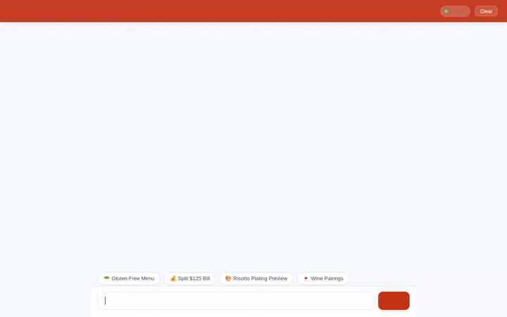

# 🍽️ Smart Dining Concierge

An autonomous AI dining assistant built with the **Google Agent Development Kit (ADK)**, **Vertex AI**, and **Google Cloud Platform**. The Smart Dining Concierge helps users discover menu items tailored to dietary restrictions, search online recipe databases, place table orders, split bills, and preview dishes via AI-generated images and video previews.



---

## 🌟 Implemented Features & Architecture

The Smart Dining Concierge agent is powered by `gemini-flash-latest` and integrates the following tools and services:

### 🛠️ Agent Tools
* **Firestore Menu Search (`search_menu_items`)**: Queries the Cloud Firestore `menu_items` database filtered by cuisine, maximum price, or dietary tag (e.g., `vegan`, `gluten-free`).
* **Dish Details Lookup (`get_dish_details`)**: Retrieves full ingredient, dietary, and pricing breakdown for any dish.
* **Menu Management (`add_menu_item`)**: Adds or updates menu items in the Firestore database.
* **Table Ordering (`place_table_order`)**: Saves table orders with customer name, table number, item list, and special notes directly to the Firestore `orders` collection.
* **Online Recipe Search (`search_online_recipes`)**: Searches public recipe databases (TheMealDB) for culinary preparation steps and key ingredients.
* **Google Maps Geocoding (`geocode_address`)**: Converts street addresses into precise latitude/longitude coordinates via Google Maps API.
* **Nearby Places Finder (`find_nearby_places`)**: Finds nearby restaurants, cafes, and bakeries using Google Maps Places API (New).
* **AI Plating Image Generation (`generate_dish_image`)**: Generates visual dish plating images using Vertex AI (`gemini-3.1-flash-lite-image` in global region), saves Playground artifacts, and uploads public images to Cloud Storage.
* **AI Dish Video Previews (`generate_dish_video`)**: Generates short culinary presentation video clips using Google's Omni model (`gemini-omni-flash-preview` in global region), saves Playground artifacts, and uploads public videos to Cloud Storage.
* **Code Execution Sandbox (`AgentEngineSandboxCodeExecutor`)**: Executes Python code in a secure sandbox for dining math, bill splitting, tax, and tip calculations.
* **Memory Bank (`VertexAiMemoryBankService` & `PreloadMemoryTool`)**: Automatically records and preloads user dietary restrictions, food allergies, and dining preferences across sessions.
* **Agent-Driven Rich UI (A2UI)**: Returns interactive UI component surfaces (Cards, Columns, Rows, Images) using the A2UI catalog schema.

---

## ☁️ Google Cloud Services Used

* **Vertex AI Reasoning Engines (Agent Engine)**: Deployed agent runtime host.
* **Vertex AI Memory Bank Service**: Persistent memory service for user preferences and allergy safety.
* **Google Cloud Firestore**: NoSQL document database (`smart-dining-db`) storing `menu_items` and `orders`.
* **Google Cloud Storage (GCS)**: Public asset bucket (`smart-dining-assets-*`) hosting generated dish images and videos.
* **Vertex AI Generative Models**:
  * `gemini-flash-latest`: Primary agent reasoning model.
  * `gemini-3.1-flash-lite-image`: High-quality dish image generation.
  * `gemini-omni-flash-preview`: Culinary video preview generation.
* **Google Maps Platform**: Geocoding API and Places API (New).
* **Cloud Run**: Serverless container platform hosting the FastAPI web chat proxy frontend.

---

## 📁 Repository Structure

```text
.
├── README.md                  # Project overview and architecture documentation
├── agent_demo.gif             # Looping demo video GIF
├── agent_demo.webm            # Full HD demo video recording with soundtrack
├── agents-cli-manifest.yaml   # Agent deployment manifest metadata
├── app/                       # ADK Agent package
│   ├── __init__.py
│   ├── a2ui_utils.py          # A2UI callback and datapart formatting
│   └── agent.py               # Main ADK agent definition and tool implementations
├── frontend/                  # Lightweight FastAPI proxy & plain HTML/CSS/JS frontend
│   ├── Procfile               # Cloud Run deployment entrypoint
│   ├── main.py                # FastAPI proxy server
│   ├── requirements.txt       # Frontend dependencies
│   └── static/
│       └── index.html         # Plain chat UI with A2UI card renderer
└── requirements.txt           # Agent package dependencies
```

---

## 🚀 Local Development & Execution Setup

### 1. Environment Setup & Dependencies

Install dependencies into a virtual environment:

```bash
python3 -m venv .venv
source .venv/bin/activate
pip install -r requirements.txt
```

Set required environment variables:

```bash
export GOOGLE_CLOUD_PROJECT="YOUR_PROJECT_ID"
export GOOGLE_MAPS_API_KEY="YOUR_API_KEY"
```

### 2. Launching Agent Engine Playground Locally

To test the agent locally with the Agent Engine / ADK Web Interface:

```bash
uv run adk web app --port 8080 --reload_agents
```

### 3. Running the FastAPI Web Chat Frontend

To run the custom chat proxy frontend locally:

```bash
cd frontend
pip install -r requirements.txt
export AGENT_ENGINE_RESOURCE_NAME="projects/<PROJECT_ID>/locations/us-central1/reasoningEngines/<ENGINE_ID>"
export AGENT_DIRECTORY="app"
python main.py
```

---

## 📜 Planned Features (Not Yet Implemented)

* Real-time POS integration for live kitchen ticket routing.
* Multi-language menu translations.
